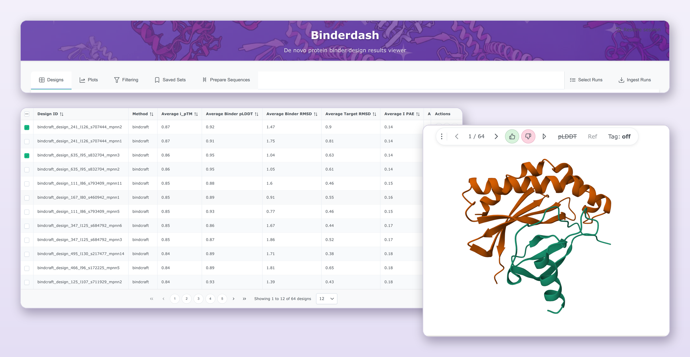

# Binderdash



**Binderdash is a tool to streamline filtering, ranking and construct design for de novo protein binders.**

Point it at the output folders from your design runs and it presents the scores and structures in one interface. Filter, rank and export ready-to-order DNA constructs.

[Documentation](https://pansapiens.github.io/binderdash/) · [Download the desktop app](https://github.com/pansapiens/binderdash/releases/latest) · [Changelog](CHANGELOG.md)

## Features

- **Reads your runs as they are.** Supports run output folders from RFdiffusion, RFdiffusion3, BindCraft and BoltzGen. Binderdash detects `nf-binder-design` pipeline outputs and imports with no reformatting needed.
- **One table across runs and methods.** Sort and compare designs from different runs side by side. Common metrics (ipTM, interface PAE, RMSD, pLDDT) are matched across pipelines that name them differently.
- **3D structure viewer.** Built on Mol\*. Step through designs, colour by chain or pLDDT, overlay a reference structure, and mark designs as good or bad as you go.
- **Filtering and ranking.** Combine score thresholds with target-contact conditions (for example "binds within 5 Å of these epitope residues"), rank on several metrics at once, and pick a shortlist that balances score against sequence diversity. The filter cascade UI shows how many designs each condition removes.
- **Plots.** Scatterplots and histograms of any two metrics against each other.
- **Saved sets.** Keep a shortlist together with the filters and ranking that produced it, and come back to it later.
- **Construct design.** Add N- or C-terminal affinity tags and linkers (His, FLAG, Strep-tag II, AviTag and others) and codon-optimise with synthesis complexity constraints, including GC content, hairpins and restriction sites. Generate short names compatible with DNA synthesis vendors naming rules. Export Twist-ready CSVs.
- **Reproducible downloads.** A design bundle holds the structures, sequences and tables together with the selections, filters and settings that produced them, so a shortlist can be traced and restored later.
- **Bring your own data.** Upload a TSV of extra columns (for example lab results) and merge it onto designs by ID to use for filtering and ranking.
- **Desktop or shared server.** Run it on your own machine, or host one instance for a group with sign-in (local accounts, Unix/PAM or Google), per-user API keys, and an optional MCP endpoint and REST API for AI agents.

## Getting started

### Desktop

Download the build for your platform from the **[latest release](https://github.com/pansapiens/binderdash/releases/latest)**:

| Platform | File |
| --- | --- |
| Linux (x86_64) | `Binderdash-<version>-x86_64.AppImage` |
| macOS (Apple silicon) | `Binderdash-<version>-macos-arm64.zip` |
| Windows (64-bit) | `Binderdash-<version>-win64.zip` |

Start the app, open **Ingest Runs**, choose the folder that contains your design runs, and ingest them. See [Desktop app](https://pansapiens.github.io/binderdash/latest/setup/desktop/) for platform notes (the builds are not code-signed, so macOS and Windows will ask you to confirm the first launch).

### Server

For a shared instance, run Binderdash with Docker Compose. It ships with a Caddy reverse proxy that handles HTTPS.

```bash
git clone https://github.com/pansapiens/binderdash.git
cd binderdash
cp .env.example .env        # then edit: RUN_BASE_DIRS, DOMAIN and sign-in settings
printf 'BINDERDASH_UID=%s\nBINDERDASH_GID=%s\n' "$(id -u)" "$(id -g)" >> .env   # run as you
docker compose up -d --build
```

Mount your run directories into the `binderdash` service in `docker-compose.yml` (read-only is fine) and list the in-container paths in `RUN_BASE_DIRS`. Then open `https://<DOMAIN>` (or `https://localhost`).

The example `.env` has authentication turned off. Before exposing the server to other people, set up sign-in as described in [Authentication](https://pansapiens.github.io/binderdash/latest/setup/authentication/). Full deployment details are in [Docker deployment](https://pansapiens.github.io/binderdash/latest/setup/docker/).

## Documentation

The full documentation is at **<https://pansapiens.github.io/binderdash/>**, covering:

- [Filtering and ranking](https://pansapiens.github.io/binderdash/latest/usage/filtering-ranking/)
- [Docker deployment](https://pansapiens.github.io/binderdash/latest/setup/docker/) and [authentication](https://pansapiens.github.io/binderdash/latest/setup/authentication/)
- The [REST API](https://pansapiens.github.io/binderdash/latest/development/api/) and [MCP server](https://pansapiens.github.io/binderdash/latest/development/mcp/) for scripted and agent access

## Development

To run Binderdash from source, work on the code, or add support for a new design pipeline, see the [development guide](docs/development/setup.md). In short:

```bash
uv venv -p python3.12 .venv && source .venv/bin/activate
uv pip install -r backend/requirements.txt
(cd frontend && pnpm install && pnpm run build)
uv run uvicorn backend.main:app --reload --port 8000
```

Contributions are welcome. Please add an entry to [CHANGELOG.md](CHANGELOG.md) for notable changes.
