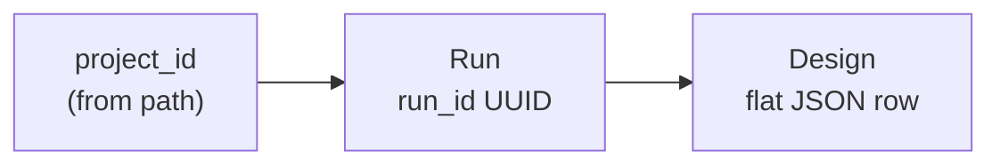

# REST API

Binderdash exposes a FastAPI REST API used by the Vue frontend and by scripts that analyse binder design runs. The same service also serves the built SPA and static assets.

Pipeline outputs (BindCraft, RFdiffusion, RFdiffusion3, BoltzGen, and others recognised by [run signatures](../../backend/config/run_signatures.py)) are ingested into SQLite (or Postgres), cached in memory, and returned as JSON. Design rows include every column from the upstream results table plus Binderdash metadata.

For machine-readable schemas, use the live OpenAPI document on your deployment. This page describes behaviour, authentication, and typical workflows.

## Base URL and OpenAPI

| Environment | Typical base URL |
| ----------- | ---------------- |
| Production | `https://binderdash.knottlab.cloud.edu.au` |
| Docker dev (`docker-compose.dev.yml`) | `http://localhost:8911` (host port → container `8000`) |
| Local uvicorn | `http://localhost:8000` |

| Resource | Path |
| -------- | ---- |
| Swagger UI | `/docs` |
| ReDoc | `/redoc` |
| OpenAPI JSON | `/openapi.json` |
| Health (no auth) | `/health` → `{"status": "healthy", "timestamp": "..."}` |

Treat **`/openapi.json` as authoritative** for request and response shapes. The examples below cover common cases; new fields or routes may appear only in the spec.

## Authentication

Protected routes require credentials unless `DISABLE_AUTHENTICATION=true` (all endpoints public). Discover what is enabled:

```http
GET /api/auth/status
```

Response includes `auth_disabled` and `providers` (`local`, `pam`, `google`, `api_key`).

Configure auth via `.env` (see `.env.example`). Relevant variables:

| Variable | Purpose |
| -------- | ------- |
| `DISABLE_AUTHENTICATION` | When `true`, skip all auth and CSRF checks |
| `BINDERDASH_API_KEY` | When non-empty, enables static API key auth (see below) |
| `LOCAL_USERS` | `user:bcrypt_hash,...` for `POST /api/auth/login` |
| `PAM_LOCAL_*` | Optional Unix PAM after local users |
| `GOOGLE_AUTH_*` | Optional Google OAuth |
| `SECRET_KEY` | JWT signing for session cookies |

### API key (scripts and automation)

When `BINDERDASH_API_KEY` is set on the server, clients send it on **every** request, including `POST` / `PATCH` / `DELETE`. No session cookie or CSRF header is required.

Supported headers (either is fine):

- `Authorization: Bearer <BINDERDASH_API_KEY>`
- `X-Binderdash-Api-Key: <BINDERDASH_API_KEY>`

```bash
export BINDERDASH_API_KEY='your-long-random-secret'
export BASE='https://binderdash.knottlab.cloud.edu.au'

curl -sS -H "Authorization: Bearer $BINDERDASH_API_KEY" "$BASE/api/runs"
```

`GET /api/auth/status` reports `providers.api_key.enabled: true` when configured. Invalid or missing keys receive `401 Authentication required`.

Generate a key with e.g. `python -c "import secrets; print(secrets.token_urlsafe(32))"`. Do not commit keys to the repository.

### Browser session (SPA)

For interactive login when no API key is configured:

1. **`POST /api/auth/login`** — body `{"username": "...", "password": "..."}`. Sets an HTTP-only session cookie and returns `csrf_token` and `user`.
2. **CSRF** — state-changing methods (`POST`, `PUT`, `PATCH`, `DELETE`) must send header `X-CSRF-Token` matching the `binderdash_csrf` cookie. `GET` / `HEAD` / `OPTIONS` are exempt. Failure → `403` with plain text `CSRF token missing` or `CSRF token mismatch`.
3. **`POST /api/auth/logout`** — clears session and CSRF cookies.

Google OAuth: `GET /api/auth/google/login` and `GET /api/auth/google/callback` (browser redirect flow).

**`GET /api/auth/me`** — current user (requires session; not used with API key alone).

## Data model

There is no separate “project” resource. Entities relate as follows:



### Project

Logical grouping identified by `project_id`, inferred from directory structure when runs are scanned. List projects by grouping `GET /api/runs` results on `project_id`.

### Run

One pipeline execution. Key fields:

| Field | Description |
| ----- | ----------- |
| `run_id` | Stable UUID (assigned at ingest) |
| `project_id` | Project name |
| `method` | `bindcraft`, `rfd`, `rfd3`, `boltzgen`, … |
| `path` | Filesystem path at ingest |
| `metadata.name` | Display name |
| `metadata.pdb_count` | Structure file count |
| `metadata.trajectory_count` | Trajectory / design count where available |
| `metadata.primary_score_stats` | Summary stats for the method’s primary score column |
| `metadata.merged_count` | Present when multiple paths merged under one name |

Runs with the same `project_id` and `metadata.name` may be merged; see `merged_paths` in stored run JSON.

### Design

One row from the run’s results table, plus Binderdash fields. Each design is a **flat JSON object**: all upstream table columns are copied in, so column names depend on the pipeline (e.g. BindCraft `Average_i_pTM`, RFD3 `iptm`, `rf3_ipsae_min`).

Common Binderdash fields:

| Field | Description |
| ----- | ----------- |
| `design_id` | Primary identifier from results table |
| `backbone_id` | `design_id` with MPNN / AF2 suffixes removed |
| `run_id`, `project_id`, `run_name`, `method`, `run_path` | Run context |
| `pdb_file` | Structure basename (not full path) |
| `source_path` | Distinguishes rows when runs are merged |
| `good` | User flag (boolean) |
| `tag` | `"N"` or `"C"` — which terminus receives preset tags in Prepare Sequences |
| `Sequence` | Binder amino-acid sequence (stored in **`extra_data`**; extract / tag-placement) |
| `binder_chain` | Chain ID used for sequence extract (default `B`) |
| `short_name` | Twist / vendor short identifier (≤32 chars) |

**Persistence:** Pipeline columns from the on-disk results table are stored in **`data_json`** and replaced on re-ingest. User annotations (uploaded table columns, extracted sequence, plugins) live in **`extra_data`** and are preserved across re-ingest. The API returns a single flat dict: `{**data_json, **extra_data}` plus dedicated columns.

The in-memory designs list is sorted by each method’s primary score (see table below). Client-side filtering and re-sorting are normal.

| Method | Primary score columns (first match used) | Default sort in cache |
| ------ | ---------------------------------------- | --------------------- |
| `bindcraft` | `Average_i_pTM` | ascending |
| `rfd` | `pae_interaction` | ascending |
| `boltzgen` | `design_to_target_iptm` | descending |
| `rfd3` | `iptm`, `pair_pae`, `rf3_ipsae_min`, `rf3_rmsd_target_aligned_binder_rmsd_all` | descending |

For BindCraft, ascending `Average_i_pTM` means lower values sort first in the API cache; re-sort client-side if “higher is better” for your analysis.

## Endpoint reference

### Auth

| Method | Path | Description |
| ------ | ---- | ----------- |
| `POST` | `/api/auth/login` | Username/password login |
| `POST` | `/api/auth/logout` | End session |
| `GET` | `/api/auth/me` | Current user |
| `GET` | `/api/auth/status` | Auth configuration (public) |
| `GET` | `/api/auth/google/login` | Start Google OAuth |
| `GET` | `/api/auth/google/callback` | OAuth callback |

### Runs

| Method | Path | Description |
| ------ | ---- | ----------- |
| `GET` | `/api/runs` | List ingested runs (memory cache) |
| `GET` | `/api/runs/{run_id}/table` | Raw results table: `columns`, `data`, `total_rows` |
| `GET` | `/api/runs/{run_id}/input-targets` | Input / target structures for reference overlay |
| `POST` | `/api/runs/scan` | Discover runs under `folders` (see ingestion) |
| `POST` | `/api/runs/ingest-preview` | Which scanned runs already exist in DB |
| `POST` | `/api/runs/ingest` | Persist runs and designs to database |
| `DELETE` | `/api/runs/{run_id}` | Remove one run from DB and cache |
| `DELETE` | `/api/runs` | Clear all runs |

### Designs

| Method | Path | Description |
| ------ | ---- | ----------- |
| `GET` | `/api/designs` | All designs; optional `?run_ids=id1,id2` |
| `DELETE` | `/api/designs` | Clear designs cache only |
| `PATCH` | `/api/designs/good` | Set or clear ★ flag |
| `PATCH` | `/api/designs/tag` | Set `tag` to `N`, `C`, or clear |
| `POST` | `/api/designs/short-names` | Bulk-update `short_name` |
| `POST` | `/api/designs/sequences` | Extract binder sequence from PDB |
| `POST` | `/api/designs/tag-metrics` | SASA / contact metrics (optional cache) |
| `POST` | `/api/designs/tag-placement` | Predict and persist `tag` |
| `POST` | `/api/designs/refresh-cache` | Reload designs cache from DB |
| `POST` | `/api/designs/merge-table` | Merge CSV/TSV columns into `extra_data` (multipart: `file`, `run_ids`, optional `preview`, `design_id_column`) |

**Merge table:** Only adds keys not already present in `data_json` or `extra_data` for each matched row. Match on `design_id` (and `source_path` when the upload includes that column). `preview=true` returns counts without writing.

### Structure files

| Method | Path | Description |
| ------ | ---- | ----------- |
| `GET` | `/api/runs/{run_id}/files/structure/{filename}` | PDB or mmCIF (`.gz` decompressed) |
| `GET` | `/api/runs/{run_id}/files/pdb/{filename}` | Legacy alias of structure route |
| `GET` | `/api/runs/{run_id}/files/reference` | TM-aligned reference mmCIF (query params below) |
| `POST` | `/api/pdbs/tar` | Stream tar of multiple structures |

**Reference overlay query parameters:** `align_filename` (design structure basename), `mode` (`manual` or `input_target`), `source` (PDB ID or URL when `manual`), `input_target_id` (when `input_target`), optional `reference_chains` (comma/space-separated). Response headers include `X-Binderdash-TM-Norm-Design`, `X-Binderdash-RMSD`, `X-Binderdash-Aligned-Length`, and optional membrane plane headers.

**Tar request body:** `{ "items": [ { "run_id": "...", "filename": "..." }, ... ] }`. Archive paths: `{project_id}/{run_name}/{filename}`.

### Sequences (DNA optimisation)

| Method | Path | Description |
| ------ | ---- | ----------- |
| `GET` | `/api/sequences/codon-tables` | List codon table IDs and labels |
| `GET` | `/api/sequences/codon-tables/{table_id}` | Frequencies and stop codons |
| `POST` | `/api/sequences/optimize-dna` | Batch codon optimisation (DnaChisel) |

### Plots (SPA)

| Method | Path | Description |
| ------ | ---- | ----------- |
| `POST` | `/api/runs/plots/columns` | Numeric columns and default x/y across runs |
| `POST` | `/api/runs/plots/scatter` | Combined scatter data |
| `POST` | `/api/runs/plots/histogram` | Combined histogram data |

For custom analysis, prefer `GET /api/designs` or `GET /api/runs/{run_id}/table` and plot in Python or R; these plot routes mainly exist for the UI.

### Filtering

| Method | Path | Description |
| ------ | ---- | ----------- |
| `POST` | `/api/filtering/columns` | Filterable columns (numeric metrics + `design_id`/`project_id`/`run_name`/`method`/`Sequence`) for a run scope |
| `POST` | `/api/filtering/preview` | Sequential filter cascade: designs remaining after each stage |
| `POST` | `/api/filtering/apply` | Hard filters only — passing design keys, debounced for live table narrowing |
| `POST` | `/api/filtering/rank` | Filters + ranking (boltzgen "Algorithm 2" worst-case rank), no diversity selection, not persisted |
| `POST` | `/api/filtering/diversity` | Full filter → rank → diversity pipeline, not persisted |
| `POST` | `/api/filtering/run` | Full pipeline, persisted as a new Saved Set |

### Saved Sets

| Method | Path | Description |
| ------ | ---- | ----------- |
| `GET` | `/api/saved-sets` | List all saved sets |
| `GET` | `/api/saved-sets/{id}` | One saved set's metadata |
| `GET` | `/api/saved-sets/{id}/designs` | Full ranked design table for the set (see below) |
| `PATCH` | `/api/saved-sets/{id}` | Rename (the only allowed mutation — sets are otherwise immutable snapshots) |
| `DELETE` | `/api/saved-sets/{id}` | Delete |
| `GET` | `/api/saved-sets/{id}/download` | ZIP: `designs.csv` (ranked rows + metrics) plus each design's structure file under `structures/` |

### Administration

| Method | Path | Description |
| ------ | ---- | ----------- |
| `GET` | `/api/tree` | Browse `RUN_BASE_DIRS` for ingest UI (`?path=` optional) |

## Common workflows

### List runs

```bash
curl -sS -H "Authorization: Bearer $BINDERDASH_API_KEY" "$BASE/api/runs" \
  | jq '.runs[] | {run_id, project_id, name: .metadata.name, method}'
```

### Designs for a project, sorted by score, as TSV

Filtering and sorting are client-side. Only `run_ids` is supported server-side.

```bash
proj="my_project"
runs=$(curl -sS -H "Authorization: Bearer $BINDERDASH_API_KEY" "$BASE/api/runs" \
  | jq -r --arg p "$proj" '.runs[] | select(.project_id==$p) | .run_id' | paste -sd,)

curl -sS -H "Authorization: Bearer $BINDERDASH_API_KEY" \
  "$BASE/api/designs?run_ids=$runs" \
  | jq -r '
      .designs
      | sort_by(-(.iptm // -1e30))
      | (["design_id","run_name","iptm","pdb_file","good"] | @tsv),
        (.[] | [.design_id, .run_name, .iptm, .pdb_file, .good] | @tsv)
    '
```

Use `sort_by(.pae_interaction // 1e30)` for ascending metrics. Export CSV with `@csv` instead of `@tsv`.

### Download one structure

```bash
run_id="..."
filename="design_model.cif"   # from design.pdb_file
curl -sS -H "Authorization: Bearer $BINDERDASH_API_KEY" \
  -o "${filename}" \
  "$BASE/api/runs/${run_id}/files/structure/$(python3 -c "import urllib.parse; print(urllib.parse.quote('$filename'))")"
```

### Bulk download structures as tar

```bash
items=$(curl -sS -H "Authorization: Bearer $BINDERDASH_API_KEY" \
  "$BASE/api/designs?run_ids=$runs" \
  | jq '[.designs[] | select(.good==true) | {run_id, filename: .pdb_file}]')

curl -sS -H "Authorization: Bearer $BINDERDASH_API_KEY" \
  -H 'Content-Type: application/json' \
  -X POST "$BASE/api/pdbs/tar" \
  -d "$(jq -n --argjson items "$items" '{items:$items}')" \
  -o designs.tar
```

## DNA codon optimisation

`POST /api/sequences/optimize-dna` back-translates and optimises protein sequences using [DnaChisel](https://edinburgh-genome-foundry.github.io/DnaChisel/) and [python_codon_tables](https://github.com/Edinburgh-Genome-Foundry/codon-usage-tables).

**Request body:**

```json
{
  "sequences": { "design_id_1": "MAEK...", "design_id_2": "MGSS..." },
  "codon_table_id": "e_coli_316407",
  "method": "match_codon_usage",
  "constraints": [
    { "type": "EnforceGCContent", "enabled": true, "params": { "mini": 0.25, "maxi": 0.64 } }
  ]
}
```

### Codon tables

`GET /api/sequences/codon-tables` returns `{ "items": [ { "value", "label" }, ... ] }`.

`GET /api/sequences/codon-tables/{table_id}` returns `value`, `label`, `stop_codons`, and `codons_by_aa` (amino acid → codon → frequency).

Common `codon_table_id` values:

| ID | Organism |
| -- | -------- |
| `e_coli_316407` | *E. coli* K-12 (default in UI) |
| `s_cerevisiae_4932` | *S. cerevisiae* |
| `h_sapiens_9606` | Human |
| `c_griseus_10029` | CHO (*C. griseus*) |
| `p_pastoris_4922` | *P. pastoris* |

### Optimisation `method`

Passed to DnaChisel `CodonOptimize`:

| Value | Behaviour |
| ----- | --------- |
| `match_codon_usage` | Match host codon usage (recommended) |
| `use_best_codon` | Highest-frequency codon per AA (can conflict with k-mer uniqueness) |
| `harmonize_rca` | Preserve relative adaptiveness when changing hosts |

### Constraints

Each constraint: `{ "type": "<name>", "enabled": true, "params": { ... } }`.

| Type | Parameters |
| ---- | ------------ |
| `EnforceGCContent` | `mini`, `maxi` (0–1); optional `window` for local GC |
| `AvoidHairpins` | `stem_size`, `hairpin_window` |
| `AvoidPattern` | `pattern`: literal string, `RepeatedKmerPattern`, or `"EnzymeName_site"` (e.g. `"BsaI_site"`) |
| `AvoidRareCodons` | `min_frequency`; species injected from `codon_table_id` |
| `UniquifyAllKmers` | `k` (e.g. 12) |

`EnforceTranslation` is always applied by the server; do not send it.

The Prepare Sequences UI uses a Twist-oriented default set (`DEFAULT_TWIST_CONSTRAINTS` in `frontend/src/stores/seqPrep.ts`). The UI-only type `ExcludeRestrictionSite` with `params.enzyme` is serialised to `AvoidPattern` with `pattern: "<enzyme>_site"` before POST.

### Optimisation response

```json
{
  "results": [
    { "design_id": "d1", "optimized_dna": "ATG...", "error": null },
    { "design_id": "d2", "optimized_dna": null, "error": "Constraints could not be resolved (No solution found)." }
  ],
  "elapsed_seconds": 2.31
}
```

Failures are per design. If many rows fail, relax `UniquifyAllKmers` or windowed `EnforceGCContent` first.

## Sequence tags (client-side assembly)

Preset tag **amino-acid sequences** are not stored as DNA on the server. The API stores only which terminus is active (`tag`: `"N"` or `"C"`). Full construct assembly matches the Prepare Sequences tab (`frontend/src/stores/seqPrep.ts`).

### Preset sequences

| Preset | Sequence | Terminus |
| ------ | -------- | -------- |
| His-N | `HHHHHHSG` | N only |
| His-C | `GSHHHHHH` | C only |
| FLAG | `DYKDDDDK` | N or C |
| cMyc | `EQKLISEEDL` | N or C |
| HA | `YPYDVPDYA` | N or C |
| G4S linker | `GGGGS` | N or C |

### Assembly order

For binder sequence `core` (from `Sequence`, trailing `*` removed) and `tag`:

```
[N-terminal prefix] [N-terminal tags if tag=="N"] core [C-terminal tags if tag=="C"] [C-terminal suffix] [optional *]
```

Workflow for a C-terminal His tag:

1. Ensure `Sequence` is set (`POST /api/designs/sequences` if missing).
2. `PATCH /api/designs/tag` with `"tag": "C"`.
3. Build `prepared_aa = core + "GSHHHHHH" + ("*" if including stop)`.
4. `POST /api/sequences/optimize-dna` with `sequences: { design_id: prepared_aa }`.

Use `POST /api/designs/tag-placement` to let the server choose N vs C from structure SASA and contacts.

Further UI behaviour (post-stop padding, short names, mixed-case sequences) is documented in [Sequence preparation](sequence_preparation.md).

## Filtering, ranking, and diversity selection

Run scope for every `/api/filtering/*` call is an explicit `run_ids` list — there is no server-side "currently selected" state. The pipeline has three independent stages, each individually reachable:

1. **Hard filters** (`FilterSpec`) — `{ "column": "...", "operator": "...", "threshold": <number|null>, "text_value": <string|null> }`. `column` accepts a canonical metric name (see `backend/filtering/metrics.py`, e.g. `iptm`, `rmsd`, `pae_interaction`) resolved per-method, a raw column name, or one of the identity columns `design_id`/`project_id`/`run_name`/`method`/`Sequence`. Numeric operators `<`, `<=`, `>`, `>=` take `threshold`; string operators `contains`, `not_contains`, `starts_with`, `ends_with`, `equals`, `not_equals`, `regex` take `text_value`; `is_empty`/`is_not_empty` take neither.
2. **Ranking** (`RankingMetric`) — `{ "column": "...", "weight": 1.0, "higher_is_better": true }`. Implements boltzgen's Algorithm 2: each design's rank on every metric is scaled by `1/weight`, and the *worst* (max) scaled rank across metrics becomes `final_rank`/`quality_score`. Designs that fail more hard filters rank worse automatically (`num_filters_passed` is folded into the sort) but are **not dropped** — `ranked` always covers every input design so the full table can show pass/fail per row.
3. **Diversity selection** (`select_diverse`) — lazy-greedy selection over binder sequence similarity + `quality_score`, controlled by `budget` (final set size), `alpha` (0 = quality only, 1 = diversity only), and optional `size_buckets` (`{"min", "max", "num_designs"}`, caps selections per sequence-length range). **Only designs that passed every hard filter are eligible** — a design failing a filter can never end up in the diverse/saved set, however small `passing_filters` is relative to `budget`.

`POST /api/filtering/run` body is `FilteringRunRequest`: `name`, `run_ids`, `filters`, `metrics`, `budget` (default 24), `alpha` (default 0.001 — BoltzGen's own default for non-peptide protocols; 0.01 for its peptide-anything protocol), `size_buckets`, `random_state`. Response:

```json
{
  "saved_set_id": "...",
  "name": "...",
  "total_input": 10000,
  "passing_filters": 42,
  "top_set_count": 24,
  "diverse_set_count": 24
}
```

`total_input` is every design across `run_ids` before filtering; `passing_filters` is how many passed every hard filter; `top_set_count` is `min(budget, total_input)` (an upper bound, not necessarily reachable); `diverse_set_count` is the actual number of designs selected into the set — this is what `SavedSet.design_count` reports afterwards (**not** `total_input`).

`GET /api/saved-sets/{id}/designs` returns every ranked design (pass or fail), each with `in_diverse_set` — use this to browse the full ranked pool with a "made the cut" flag; use `SavedSet.design_count`/`total_input` from `GET /api/saved-sets/{id}` for the summary counts.

`SavedSet.source_run_ids` records which runs a set was built from — resolve to display names via `GET /api/runs`.

## Run ingestion

Used by the **Select Runs** UI to discover and persist runs from `RUN_BASE_DIRS`:

1. **`GET /api/tree`** — browse allowed base directories.
2. **`POST /api/runs/scan`** — body `{ "folders": ["/path/..."], "force_rescan_of_ingested": false }`. Returns discovered run metadata; skips already-ingested runs unless forced.
3. **`POST /api/runs/ingest-preview`** — body `{ "runs": [ ... ] }`. Lists runs that would be re-ingested.
4. **`POST /api/runs/ingest`** — body `{ "runs": [ ... ] }`. Requires `DATABASE`. Assigns stable `run_id`, stores designs, refreshes cache.

Deleting a run (`DELETE /api/runs/{run_id}`) removes database and cache entries only; files on disk are unchanged.

## Related documentation

- [Pipeline method types](pipeline-methods.md) — run signatures, score columns, structure paths
- [Sequence preparation](sequence_preparation.md) — short names, hashing, UI behaviour
- Agent-oriented quick reference: [`skills/binderdash-api/SKILL.md`](../../skills/binderdash-api/SKILL.md)
